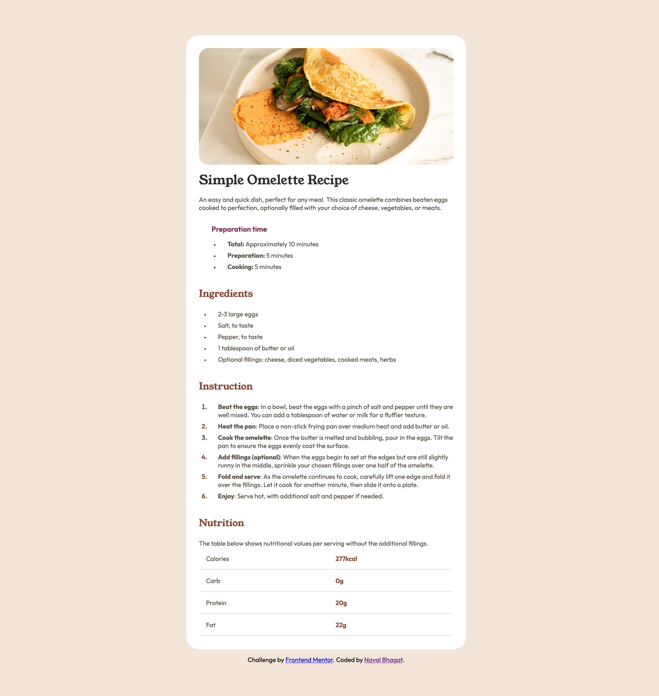

# Frontend Mentor - Recipe page solution

This is a solution to the [Recipe page challenge on Frontend Mentor](https://www.frontendmentor.io/challenges/recipe-page-KiTsR8QQKm). Frontend Mentor challenges help you improve your coding skills by building realistic projects.

## Table of contents

- [Overview](#overview)
  - [Screenshot](#screenshot)
  - [Links](#links)
- [Author](#author)

## Overview

### Screenshot

### Links

- Solution URL: [Github](https://github.com/navalBhagat/recipe-page-fe-mentor)
- Live Site URL: [Vercel](https://recipe-page-fe-mentor-iota.vercel.app/)

## Author

- Frontend Mentor - [@navalBhagat](https://www.frontendmentor.io/profile/navalBhagat)
